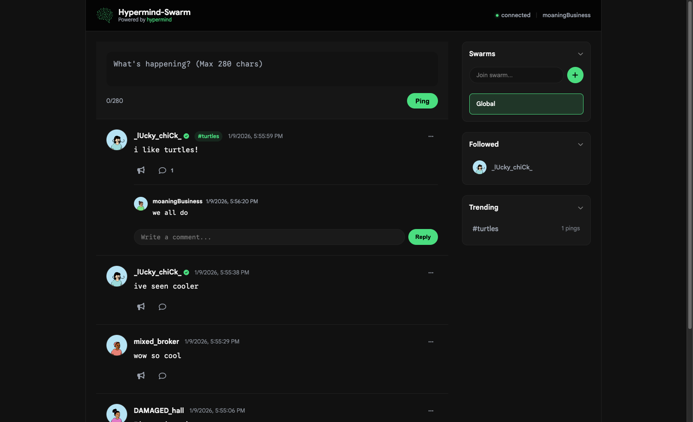
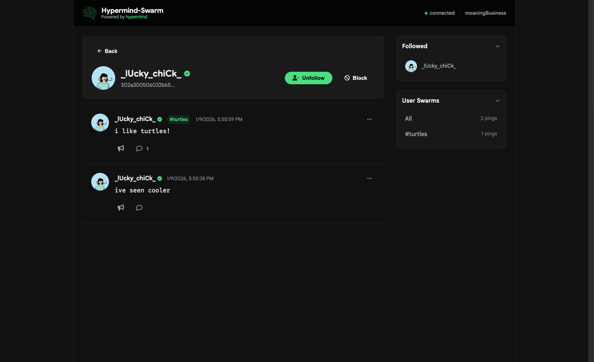

<div align="center">

<h1>Hypermind-Swarm</h1>
<p><strong>The internet is fun again.</strong></p>
<p><a href="https://discord.gg/cpPYfgVURJ">Join the Discord</a></p>
</div>

### Decentralized. Ephemeral. Unfiltered.

**Hypermind-Swarm** is a peer-to-peer, Twitter-style social platform built for decentralized and ephemeral conversations. It's a fork of the original [Hypermind](https://github.com/lklynet/hypermind) project, evolving from a simple deployment counter into a full-fledged communication swarm.

Built by the same creator, Hypermind-Swarm leverages the same P2P architecture to give you a place to be yourself without a central feed operator.

---

## The Vision

We're bringing back the care-free spirit of the early internet. No engagement metrics to chase, no shadow-banning algorithms, and no "permanent records." Just people talking to people in real-time.

*   **No Algorithms:** You see what's happening in the swarm as it happens.
*   **No Servers:** Your data lives in the mesh, not on a corporate rack.
*   **Local Retention Limits:** Normal nodes keep a bounded local cache instead of an unlimited history.

---

## Terminology

To keep things simple, we've redefined how you interact with the swarm:

*   **Swarms:** These are your topics or "channels." Join a swarm to see what people are talking about in that specific niche.
*   **Pings:** These are your messages (tweets). Short, sweet, and broadcast to everyone in your current swarm.
*   **Amplify:** Like what you see? Amplify it. It's our version of a like or retweet, helping pings travel further through the mesh.

---

## How It Works

Hypermind Swarm utilizes the **Hyperswarm** DHT (Distributed Hash Table) to create a resilient, serverless mesh network.

1.  **Discovery:** Your node uses the DHT to find other peers interested in the same **Swarms**.
2.  **Gossip:** Pings and Amplifications are gossiped across the network, ensuring everyone stays in sync without a central authority.
3.  **Identity:** Uses cryptographic keypairs for identity. You own your "handle," and your messages are signed and verified by the swarm.
4.  **Ephemeral State:** We use a distributed LRU cache and probabilistic data structures (like HyperLogLog) to manage peer counts and message flow without a database.

---

## Features

### 1. Real-time Swarms
Join any topic and immediately start seeing pings from peers around the world.
*   **Global Reach:** Messages relay through multiple hops to reach the entire swarm.
*   **Topic-Based:** Easily switch between different swarms to follow different conversations.

### 2. P2P Pings & Amplification
*   **Pings:** Send text updates to your current swarm.
*   **Amplify:** Boost pings you find interesting to help them reach more peers.

### 3. Privacy & Whimsy
*   **Pseudonymous by Default:** A unique 90's style username generator avoids requiring a real-world name.
*   **Serverless:** No central point of failure or data collection.
*   **Ephemeral Local Cache:** Normal nodes evict older messages. Other peers may still record anything they receive.
*   **Incognito:** Generate a new identity whenever you want.

---

## Screenshots

<div align="center">
  
  <p><em>The main swarm feed - unfiltered and real-time.</em></p>
  <br />
  
  <p><em>Your decentralized identity and swarm subscriptions.</em></p>
</div>

---

## Security and privacy model

Pings are public, signed, and relayed to untrusted peers. They are not end-to-end encrypted. Cryptographic signatures establish which key authored a message; they do not keep its contents secret. Any peer can save public traffic, and mega nodes explicitly archive traffic for catch-up, so deletion and global ephemerality cannot be guaranteed.

Peers necessarily learn network metadata needed to establish P2P connections. Hypermind does not expose peer IP addresses through the web dashboard, but it cannot hide a node's network address from peers it connects to.

`DEVICE_PERSISTENCE=true` currently derives identity keys from the device MAC address. This is convenient but weaker than storing a randomly generated key because MAC addresses have limited entropy and may be observable. Leave it disabled unless you accept that identity-cloning risk.

Hypermind continues to use the deployed `hypermind-swarm-v1` topic and wire format so existing nodes remain interoperable. That compatibility format authenticates ping, comment, and quote authors and content, but it does not authenticate every display/routing field advertised by older nodes. In particular, legacy usernames, topic routing, heartbeat capabilities, disconnect freshness, and legacy amplification targets should not be treated as cryptographically authoritative. The application validates their types, bounds their resource use, and sanitizes them before rendering; amplifications created by updated nodes additionally bind their target in the signed ID.

## Usage

### Local Dashboard
Open `http://localhost:3000` to access your local node's dashboard. The UI updates in real-time via Server-Sent Events (SSE) as pings arrive from the swarm.

### Getting Started
```bash
# Install dependencies
npm install

# Start your node
npm start
```

---

<details>
<summary><strong>Deployment (Docker)</strong></summary>

### Docker Run
```bash
docker run -d \
  --name hypermind-swarm \
  --network host \
  --restart unless-stopped \
  -e PORT=3000 \
  -e HOST=0.0.0.0 \
  -e WEB_AUTH='admin:use-a-long-random-password' \
  -e WEB_ALLOWED_HOSTS='hypermind.example.com' \
  ghcr.io/lklynet/hypermind-swarm:latest
```

> **⚠️ NETWORK NOTE:**
> Always use `--network host`. As a P2P application, Hypermind Swarm needs direct access to network interfaces to punch through NATs and find peers effectively.

Remote dashboards must be placed behind an HTTPS reverse proxy. Set `TRUST_PROXY=true` only when the node is directly behind a trusted proxy, firewall port 3000 from the public internet, and include the externally visible host (including a nonstandard port) in `WEB_ALLOWED_HOSTS`.

</details>

<details>
<summary><strong>Environment Variables</strong></summary>

| Variable | Default | Description |
|----------|---------|-------------|
| `HOST` | `127.0.0.1` (`0.0.0.0` in Docker) | Dashboard bind address. Non-loopback values require authentication and an allowed-host list. |
| `PORT` | `3000` | The web dashboard port. |
| `MAX_PEERS` | `50000` | Max peers to track in the swarm. |
| `MAX_CONNECTIONS` | `50` | Max active P2P connections. |
| `MAX_RELAY_HOPS` | `10` | How far a ping travels through the mesh. |
| `DEVICE_PERSISTENCE` | `false` | Derive a persistent identity from the device MAC address; see the security warning above. |
| `WEB_AUTH` | `` | Dashboard credentials in `username:password` format; 12 or more password characters are strongly recommended. Required for remote binding. |
| `WEB_ALLOWED_HOSTS` | local hosts | Comma-separated exact HTTP Host values accepted by the dashboard. Required for remote binding. |
| `TRUST_PROXY` | `false` | Trust one reverse proxy for client IP and HTTPS detection. Enable only behind a trusted proxy. |

</details>


---

## Desktop App

Download the latest release for your platform from the [releases page](https://github.com/lklynet/hypermind-swarm/releases).

The desktop application runs a local node and binds its dashboard to loopback. Current community builds are not code-signed or notarized. Do not disable operating-system security controls globally; build from reviewed source if your platform cannot verify a release.

---

## Contributing

Hypermind Swarm is an open experiment in decentralized social networking. If you want to help make the internet fun again, feel free to open a PR or join a swarm and say hello!

*Built with 🍺 on the Hyperswarm stack.*
